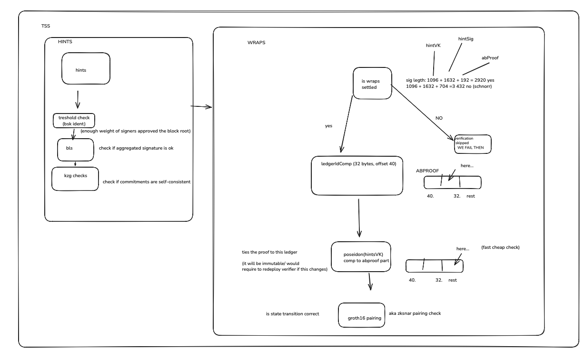
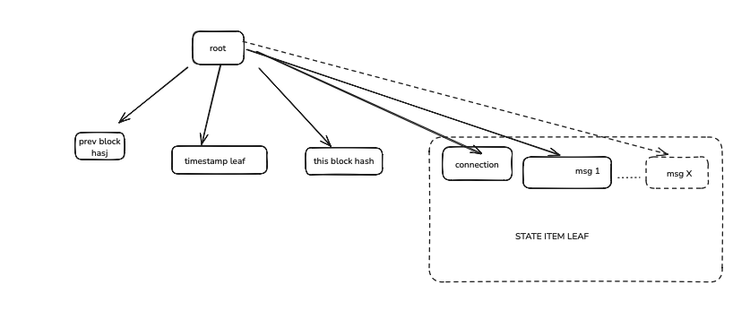

# Hiero Proof Verifier — Specification

**Status:** Implemented, revision 2026-05-20
**Scope:** Reference implementation of `IClprVerifier` for bundles originating from a Hiero ledger using TSS-signed block proofs.
**Anchors to:** `trust-anchor.md` §Hiero example, `IClprVerifier` interface, CLPR §3.1.


## Overview

HieroVerifier implements IClprVerifier for bundles originating on a Hiero ledger. It verifies a Hiero state proof that authenticates:
- The block root (a SHA‑384 Merkle root, 48 bytes), via a threshold aggregate signature (TSS), and
- Inclusion proofs for specific state leaves: a ClprChannel state item and zero or more ClprMessageValue leaves.

On success, it returns:
- Queue metadata derived from the proven ClprChannel,
- The message payloads extracted from proven ClprMessageValue leaves, and
- A 32-byte newTrustAnchor equal to keccak256(hintsVK); callers should cache and supply it back on subsequent verifications to enable Poseidon-skip fast path in WRAPS.

The verifier’s only trust anchor is the peer ledgerId bytes that are set in the constructor and later carried by the channel as trustAnchor.

## Construction

Constructor: `constructor(bytes memory ledgerId_, TSSVerifier tssVerifier_)`

- Inputs
  - `ledgerId_` — raw Hiero ledger network identifier, non‑empty bytes. This becomes the channel’s trustAnchor and is returned by verifyConfig. It is not hashed on-chain; the raw bytes are retained.
  - `tssVerifier_` — address of a pre‑deployed TSSVerifier that encapsulates WRAPS/BN254/Poseidon logic for verifying the Hiero block signature.
- Storage
  - `bytes public ledgerId;` — stored raw ledger ID bytes.
  - `TSSVerifier public immutable tssVerifier;` — stored reference to TSS verifier.
- Reverts
  - `ClprHieroEmptyLedgerId()` if `ledgerId_.length == 0`.

## verifyBundle

Signature:
```
function verifyBundle(bytes calldata proofBytes, bytes calldata trustAnchor)
  external view
  returns (
    ClprTypes.QueueMetadata memory metadata,
    bytes[] memory messagePayloads,
    bytes memory newTrustAnchor
  )
```

Inputs
- `proofBytes`: a Hiero StateProof protobuf message, binary‑encoded. See ClprStateProof.decode for the schema used by the contract.
- `trustAnchor`: cache hint supplied by the caller. When equal to `keccak256(hintsVK)` for the embedded WRAPS verification key, the verifier can skip the Poseidon hash recomputation. Otherwise, full verification is performed and a new trust anchor is returned on success.

Processing steps
1) Decode state proof envelope
   - `ClprStateProof.StateProofDecoded memory sp = ClprStateProof.decode(proofBytes);`
   - Require that `sp.signature.length != 0` (the proof must contain a `signed_block_proof` alternative of the oneof).
   - Failure: `ClprHieroBlockProofMissing()` if the signature is absent.

2) Locate a base state-item-leaf path and compute the block root
   - `uint256 baseIdx = ClprMerkleProof.findFirstPath(sp.paths, StateItemLeaf);`
   - Failure: `ClprHieroNoStateItemLeaf()` if no `state_item_leaf` is present.
   - Compute chained root over the chosen path: `bytes memory blockRootHash = ClprMerkleProof.computeChainedRoot(sp.paths, baseIdx);`
   - Enforce `blockRootHash.length == 48`.
   - Failure: `ClprHieroBlockHashLength(gotLen)` if the chained root is not 48 bytes.

3) Authenticate the block via TSS aggregate signature
   - Call into the shared verifier: `tssVerifier.verifyTSS(ledgerId, sp.signature, blockRootHash)`.
   - This performs the WRAPS pairing check with the ledger’s WRAPS VK and checks the aggregate signature against the block root. See “TSS/WRAPS path” below.
   - Failure: `ClprHieroTssVerificationFailed()` if the TSS verification returns false.

   

   Diagram: Threshold-signature (TSS) verification over the block root using WRAPS ensures the block is authentic; we only trust Merkle paths after this succeeds.

4) Validate all proven paths and extract channel + messages
   - `ClprStateProof.extractDecodedQueueData(sp.paths, blockRootHash)` does:
     - Validates each provided Merkle path in `sp.paths` against `blockRootHash`.
     - Ensures the channel’s `ClprChannel` leaf is present and decodes it.
     - Extracts all `ClprMessageValue` leaves and returns an array of message payload bytes.
   - Failure: Propagates `ClprTypes.VerifyFailed(string)` and other library errors if any path fails or required data is missing.

     

     Figure: State-proof Merkle tree showing the ClprChannel leaf (for queue metadata) and one or more ClprMessageValue leaves; the verifier proves inclusion against the block root and extracts the message payloads.

5) Synthesize QueueMetadata and outputs
   - Set `metadata` from the proven `channel`:
     - `nextMessageId = channel.ackedMessageId + 1 + uint64(payloads.length)`
     - `sentRunningHash = channel.sentRunningHash`
     - `receivedMessageId = channel.receivedMessageId`
     - `receivedRunningHash = channel.receivedRunningHash`
     - `state = channel.status`
   - `messagePayloads = payloads` (exact array order as extracted by the library).
   - `newTrustAnchor` is returned as `keccak256(hintsVK)` (32 bytes) to be cached by the caller and supplied on subsequent calls as `trustAnchor` for gas savings.

Outputs (on success)
- `metadata`: QueueMetadata representing the receiver’s expected post‑bundle state.
- `messagePayloads`: list of bytes payloads extracted from the message leaves.
- `newTrustAnchor`: 32-byte `keccak256(hintsVK)` used to enable Poseidon-skip caching in WRAPS on subsequent verifications.

Reverts and failure modes
- `ClprHieroBlockProofMissing()` — state proof has no signature.
- `ClprHieroNoStateItemLeaf()` — no base state‑item leaf to derive the root and decode the channel.
- `ClprHieroBlockHashLength(got)` — computed container/chained root is not 48 bytes.
- `ClprHieroTssVerificationFailed()` — TSS/WRAPS pairing/signature check failed.
- `ClprTypes.VerifyFailed(string)` and other decoding / path validation errors bubble up from libraries.


## verifyConfig

Signature:
```
function verifyConfig(bytes calldata configProofBytes)
  external view
  returns (
    string chainId,
    bytes serviceAddress,
    uint96 peerConfigNanos,
    ClprTypes.Throttles throttles,
    bytes initialTrustAnchor,
    bytes initialTrustAnchorId,
    ClprTypes.Endpoint[] seedEndpoints
  )
```

Two modes:

A) Empty config proof (stateless bootstrap)
- If `configProofBytes.length == 0`:
  - Returns default throttles:
    - `maxMessagesPerBundle = 100`
    - `maxMessagePayloadBytes = 100_000`
    - `maxGasPerMessage = 1_000_000`
    - `maxQueueDepth = 1000`
    - `maxSyncBytes = 100_000`
  - Returns `initialTrustAnchor = ledgerId` (the raw constructor bytes).
  - Other returns empty/zero values: `chainId = ""`, `serviceAddress = ""`, `peerConfigNanos = 0`, `initialTrustAnchorId = ""`, `seedEndpoints = []`.

B) Structured config proof
- Decoding: `ClprProtobuf.decodeControlMessage(configProofBytes)` → `ClprTypes.DecodedControl` → `.config`.
- Returns
  - `chainId = cfg.chainId`
  - `serviceAddress = cfg.serviceAddress`
  - `peerConfigNanos = cfg.nanosSinceEpoch`
  - `throttles = cfg.throttles`
  - `initialTrustAnchor = ledgerId`
  - `initialTrustAnchorId = ""`
  - `seedEndpoints`: normalized from `cfg.seedEndpoints` as follows.

Endpoint key normalization
- If `ep.ecdsaSigningKey` is 65 bytes and begins with `0x04` (uncompressed SEC1 format), it is converted to 64‑byte raw X||Y by stripping the first prefix byte.
- If the key length is neither 64 nor 0 after the above, revert `ClprTypes.VerifyFailed("bad endpoint pubkey")`.
- Other endpoint fields (`ipAddress`, `port`, `tlsCertificate`, `accountId`) are forwarded unchanged.


## Trust model and anchors

- Trust anchor at config time: `ledgerId` bytes provided to the constructor. These bytes are returned from `verifyConfig` as the `initialTrustAnchor` and should be stored by the channel.
- Trust anchor during bundle verification: HieroVerifier returns a 32-byte value equal to `keccak256(hintsVK)` on successful verification. Callers should cache this value and pass it back as the `trustAnchor` argument on subsequent calls. When it matches the current `hintsVK`, the verifier can skip the Poseidon hash inside WRAPS, reducing gas.
- The hintsVK is not a ledger-identity trust anchor; it remains embedded and validated within the TSS/WRAPS flow. The `trustAnchor` value is a cache hint that binds to the exact `hintsVK` bytes and is used solely for performance.


## TSS/WRAPS verification path (high level)

- Hiero’s block root is authenticated using an aggregate signature verified on BN254.
- HieroVerifier delegates signature checking to `TSSVerifier.verifyTSS(ledgerId, signature, blockRootHash)`.
- Inside TSSVerifier:
  - It calls a deployed WRAPSVerifierContract which wraps the pure library `WRAPSVerifier` and Poseidon/BN254 utilities.
  - `WRAPSVerifier.verify(...)` enforces exact proof layout and length, checks the ledgerId matches, validates a Poseidon hint hash, verifies points/flags, then performs an 8‑pairing check via `BN254Util.ecPairing`.
  - Key error strings raised there include:
    - `WRAPSVerifier: bad length`
    - `WRAPSVerifier: ledgerId mismatch`
    - `WRAPSVerifier: Poseidon mismatch`
    - `WRAPSVerifier: u_cmE not infinity`
    - `WRAPSVerifier: pairing failed`

References in repo:
- `src/verifiers/TSSVerifier.sol`
- `src/verifiers/WRAPSVerifierContract.sol`
- `src/libraries/WRAPSVerifier.sol`
- `src/verifiers/Poseidon*.sol`, `src/libraries/BN254Util.sol`


## Libraries used by HieroVerifier

- `ClprStateProof` — protobuf decoding of Hiero state proof bytes and extraction of queue data from verified paths.
- `ClprMerkleProof` — computation and verification of SHA‑384 chained Merkle roots over provided paths.
- `ClprProtobuf` — decoding of control/configuration messages.
- `ClprTypes` — typed data structures, throttles, endpoints, queue metadata, and a generic `VerifyFailed(string)` error used by libs.


## Error catalogue (HieroVerifier)

- `ClprHieroEmptyLedgerId()` — constructor: empty `ledgerId_`.
- `ClprHieroBlockProofMissing()` — verifyBundle: state proof carries no `signed_block_proof`.
- `ClprHieroNoStateItemLeaf()` — verifyBundle: no `state_item_leaf` path present.
- `ClprHieroBlockHashLength(uint256 got)` — verifyBundle: computed block root hash length != 48.
- `ClprHieroTssVerificationFailed()` — verifyBundle: TSS/WRAPS verification returned false.
- Plus errors rethrown from `ClprTypes`, `ClprStateProof`, and `ClprMerkleProof` when decoding or path validation fails.


## Determinism, state and gas

- Stateless: HieroVerifier does not mutate storage during verification. `ledgerId` and `tssVerifier` are immutable post‑deploy (except `ledgerId` which is a bytes stored at construction and never changed). `verifyBundle` and `verifyConfig` are `view`.
- Deterministic output: given the same `proofBytes` and `ledgerId`, outputs are fully deterministic.


## Testing references

Look at these tests for concrete fixtures and edge cases:
- `test/HieroVerifier.t.sol` — integration test using real state proof data (`test/verification-inputs/stateProof.bin`).
- `test/HieroVerifierEdgeCases.t.sol` — constructor checks, config decoding, endpoint normalization, and failure paths.
- `test/HieroSubmitBundle.t.sol` — end‑to‑end submission with real ClprService and HieroVerifier.
- `test/WRAPSVerifier.t.sol` — WRAPS verifier unit tests referenced via TSSVerifier path.

Fixtures and scripts:
- `test/verification-inputs/stateProof.bin` — binary Hiero state proof.
- `test/verification-inputs/trustAnchor.bin` — `ledgerId` passed to HieroVerifier constructor.
- `test/verification-inputs/establish-channel.ts` — deploy HieroVerifier and set up a channel for E2E.
