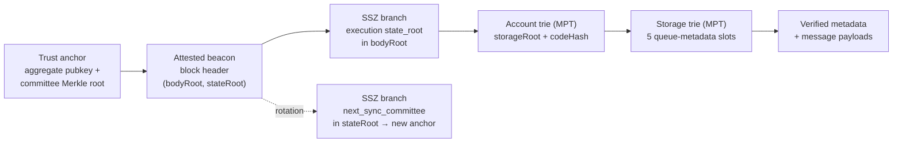
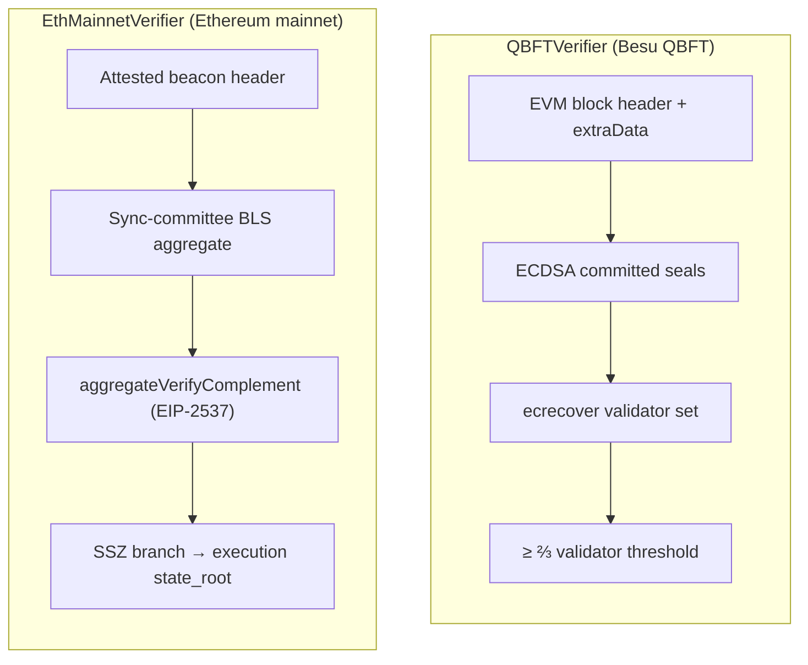
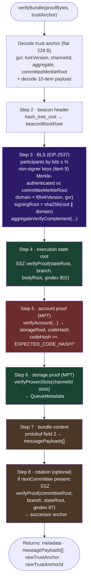
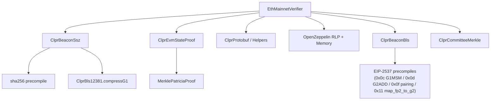

# EthMainnetVerifier

> **Source**: [EthMainnetVerifier.sol](./EthMainnetVerifier.sol)
> **Interface**: [IClprVerifier.sol](../../interfaces/IClprVerifier.sol)

---

## 1. The big picture

The CLPR protocol needs to **trustlessly verify state from a peer Ethereum chain** entirely on-chain. `EthMainnetVerifier` answers: *"prove to me that this bundle of cross-chain messages actually existed in the peer CLPR service contract's storage on Ethereum mainnet."*

It is a real **consensus-layer light client**: it builds a chain of cryptographic trust from a sync-committee BLS signature down to individual storage slots.



Each arrow is a proof the contract verifies on-chain. If any link breaks, the whole call reverts. Note there is **no EVM block header**: the execution `state_root` is proven *directly* against the beacon `bodyRoot` via SSZ.

> [!IMPORTANT]
> **All points are EIP-2537 *uncompressed*.** On-chain decompression is gas-infeasible (~22.8M for the 512 G1 pubkeys, ~49.5M for a single compressed G2 signature), so the relayer supplies uncompressed keys (the non-signers' per bundle, the full next committee at rotation) and signature; the contract only ever *compresses* (cheap) to rebuild the beacon SSZ committee root at rotation. The BLS aggregate verification is fully on-chain (EIP-2537) — see §7.

---

## 2. Differences with QBFTVerifier

Ethereum mainnet uses **Proof of Stake with sync-committee BLS signatures**, not QBFT committed seals, and it commits to its execution state through SSZ rather than an RLP block header.



The **shared** part is the bottom half: MPT account + storage proofs ([ClprEvmStateProof](../../libraries/proof/evm/ClprEvmStateProof.sol)) and the protobuf bundle-content decode. Only "how do we trust this state root?" differs.

---

## 3. Configuration & trust anchor

The **trust anchor** is a **flat packed 260-byte layout** (fixed offsets, no RLP). The 512 committee keys are **not stored** — the anchor commits to them with a keccak Merkle root ([ClprCommitteeMerkle](../../libraries/proof/beacon/ClprCommitteeMerkle.sol)):

```
gvr32 ‖ forkVersion4 ‖ channelId32 ‖ aggregatePubkey128 ‖ committeeMerkleRoot32 || codeHash
```

| Offset | Field | Bytes | Description |
|---|---|---|---|
| 0 | `genesisValidatorsRoot` | 32 | Chain-pinning root, folded into the BLS signing domain. |
| 32 | `forkVersion` | 4 | Current fork version, folded into the signing domain. Refreshed via a config update on a hard fork. |
| 36 | `channelId` | 32 | The CLPR channel this anchor authenticates. Seeded from `verifyConfig`'s `channelId`, carried through every rotation, and used to derive the exact storage slots the bundle must prove. |
| 68 | `aggregatePubkey` | 128 | The committee's precomputed aggregate (uncompressed EIP-2537 G1). Feeds the pairing directly at full participation. |
| 196 | `committeeMerkleRoot` | 32 | keccak Merkle root over the 512 uncompressed member pubkeys. Per bundle the relay supplies only the **non-signers'** keys (proof item 9), each authenticated against this root. |
| 228 | `codeHash` | 32 | The `keccak256` hash of the expected contract code. |

260 bytes means the service's per-bundle anchor SLOAD and per-rotation SSTORE shrink from ~2,055 storage slots to 8. Only a **rotation** bundle carries a full committee — namely the *next* one — whose Merkle root (once its SSZ branch verifies) goes into the successor anchor.

---

## 4. Proof layout

The bundle proof is a **top-level RLP list of 10 items**:

| # | Item | Contents |
|---|---|---|
| 0 | `attestedHeader` | `[slot, proposerIndex, parentRoot, stateRoot, bodyRoot]` |
| 1 | `syncAggregate` | `[bits(64 B), signature(256 B uncompressed G2)]` |
| 2 | `executionStateRoot` | 32-byte execution-layer state root (the SSZ leaf) |
| 3 | `executionBranch` | 9 SSZ sibling hashes (gindex 802) |
| 4 | `nextCommittee` | rotation committee `[uncompressedPubkeys[512], uncompressedAgg128]` (128 B EIP-2537 keys), or an empty RLP **string** if absent. The contract derives the compressed form on-chain to rebuild the SSZ root. |
| 5 | `nextCommitteeBranch` | 6 SSZ siblings (gindex 87), or an empty RLP **list** if absent |
| 6 | `accountProof` | MPT account proof against `executionStateRoot` |
| 7 | `storageProof` | 4 × `[slotKey, proofNodes]` (ACK-only) or 5 (with outbound messages) against the account `storageRoot` |
| 8 | `bundleContent` | protobuf `ClprBundleContent` |
| 9 | `nonSignerProofs` | one 416-byte entry `uncompressedKey(128) ‖ 9 Merkle siblings (288)` per **clear** participation bit, in ascending index order; each is authenticated against the anchor's `committeeMerkleRoot`. Empty RLP list at full 512/512 participation. |

The rotation pair (4 & 5) is **both-present or both-absent**.

---

## 5. Step-by-step verification flow

This is the core of [`verifyBundle`](./EthMainnetVerifier.sol):



`newTrustAnchorId` is the successor committee's **sync-committee period** (`slot / 8192`) as an 8-byte big-endian value — a compact, monotonic handle, not a hash of the ~66 KB anchor — and is empty when no rotation occurred.

---

## 6. Deep dive: key steps

### Step 3 — sync-committee BLS

The sync committee (512 validators, rotated every ~27 h) co-signs each beacon block. Verification reads the 64-byte `bits` vector, requires a **2/3 supermajority** of 512, collects the non-signers' keys from proof item 9 — each Merkle-authenticated against the anchor's `committeeMerkleRoot` at its **committee index** (positional binding, so a relay cannot pass an arbitrary point as a "non-signer") — derives the signing domain, and verifies the aggregate signature via `aggregateVerifyComplement` (recovering the participant aggregate as `committeeAggregate − Σ(non-signers)` — cost scales with the non-signer count) over:

```
signingRoot = sha256( beaconBlockRoot ∥ domain )
domain      = 0x07000000 ∥ sha256( pad32(forkVersion) ∥ genesisValidatorsRoot )[0:28]
```

`computeSyncCommitteeDomain` and the SSZ helpers live in [ClprBeaconSsz](../../libraries/proof/beacon/ClprBeaconSsz.sol); the on-chain aggregation + pairing in [ClprBeaconBls](../../libraries/proof/beacon/ClprBeaconBls.sol) — see §7.

### Step 4 & 8 — SSZ Merkle branches

The execution `state_root` and `next_sync_committee` sit at fixed positions in SSZ binary trees. [`ClprBeaconSsz.verifyProof`](../../libraries/proof/beacon/ClprBeaconSsz.sol) walks the generalized index bit-by-bit (`sha256(left ∥ right)`):

| Leaf | Tree root | gindex | depth / index |
|---|---|---|---|
| `execution_payload.state_root` | `bodyRoot` | **802** | 9 / 290 |
| `next_sync_committee` | `stateRoot` | **87** | 6 / 23 |

The committee root is `sha256(merkleize(512 × sha256(pad64(pubkey48))) ∥ sha256(pad64(aggregate48)))` over the **compressed** 48-byte keys (the beacon-native encoding the proof commits to). The relayer ships only the **uncompressed** next committee, so `syncCommitteeRootFromUncompressed` derives each compressed key on-chain (`compressG1`, the cheap direction) and merkleizes — reconstructing that exact root. Matching the proven root authenticates the uncompressed keys in one pass (fail-closed: `compressG1` is injective, so a wrong key can't reproduce the committed root); no separate compressed committee or compress-and-compare bind is needed. The successor anchor then stores only the **keccak Merkle root** over those uncompressed keys ([ClprCommitteeMerkle.root](../../libraries/proof/beacon/ClprCommitteeMerkle.sol)) plus the new aggregate — not the keys themselves.

### Step 5 & 6 — EVM state proofs (MPT)

Shared with QBFTVerifier via [ClprEvmStateProof](../../libraries/proof/evm/ClprEvmStateProof.sol).

- **Account proof** — walks the state trie from `executionStateRoot` to `keccak256(EXPECTED_CONTRACT_ADDRESS)`, yielding `[nonce, balance, storageRoot, codeHash]`. `codeHash` is checked against the immutable.
- **Storage proof** — `verifyProvenSlots` proves each entry against the **caller-derived** slot for `channelId` (from the trust anchor), exactly like QBFTVerifier. The slots are never read from the proof, so the proven values are cryptographically bound to *this* channel's `Channel` struct — a relay cannot reorder them or substitute another channel's slot. The proof carries 4 entries (ACK-only) or 5 (with outbound messages):

| Slot index | Channel slot | Decoded field(s) |
|---|---|---|
| 0 | `+1` `verifier(20)\|status(1)\|nextMessageId(8)` | `state = slot>>160`, `nextMessageId = slot>>168` |
| 1 | `+2` `acked(8)\|received(8)\|nextExpectedReply(8)` | `receivedMessageId = slot>>64` |
| 2 | `+4` `sentRunningHash` | `sentRunningHash` |
| 3 | `+5` `receivedRunningHash` | `receivedRunningHash` |
| 4 | `_messageQueues[channelId][nextMessageId-1]` `runningHashAfterProcessing` | proven but not surfaced in metadata |

---

## 7. BLS verification

`_verifyBls` runs the real on-chain BLS12-381 check via [ClprBeaconBls](../../libraries/proof/beacon/ClprBeaconBls.sol) (EIP-2537 precompiles). All points arrive **uncompressed** (the relayer's wire format), so there is **no on-chain decompression**:

1. Select the **non-participants** from `bits` (bit clear), require `3·participants ≥ 2·512` (`InsufficientParticipation` otherwise). Their keys arrive in proof item 9 (one 416-byte `key ‖ proof` entry per clear bit, ascending order) and each is Merkle-authenticated against the anchor's `committeeMerkleRoot` before use; with full participation the item is an empty list and no key material is needed.
2. **Recover the participant aggregate by complement**: the anchor's `aggregatePubkey` minus the non-participants, `aggregate + Σ nonParticipant·(r−1)`, in a single `BLS12_G1MSM` (0x0c) — `1 + |non-signers|` terms (≤ ⅓ of the committee at the supermajority), and no MSM at all when everyone signed.
3. **Hash-to-G2** the signing root per RFC 9380 (`expand_message_xmd` → 2× `MAP_FP2_TO_G2` (0x11) → `G2ADD` (0x0d)) under the ETH2 POP ciphersuite.
4. **Pairing**: `BLS12_PAIRING_CHECK` (0x0f) of `e(aggPubkey, H(signingRoot)) · e(−G1, sig) == 1`.

On-chain **compression** (the cheap, MODEXP-free direction, ~720 gas/key) is used only at rotation, to rebuild the beacon SSZ committee root from the uncompressed keys (§4 & 8). Gas (cost scales with the **non-signer** count, so high participation is cheapest): the aggregate verify is ~1.35M at the 342/512 supermajority and ~0.22M at full 512/512; see [GasUsage.t.sol](../../../test/verifiers/ethereum/GasUsage.t.sol) and the `baselines.yml` benchmarks.

---

## 8. Library dependency map



| Library | Purpose | Shared with QBFT? |
|---|---|---|
| [ClprBeaconSsz](../../libraries/proof/beacon/ClprBeaconSsz.sol) | SSZ Merkle branches, header/committee `hash_tree_root`, signing domain | ETH-only |
| [ClprCommitteeMerkle](../../libraries/proof/beacon/ClprCommitteeMerkle.sol) | keccak Merkle commitment over the 512 committee keys: `root` at rotation, `verifyEntry` per non-signer per bundle | ETH-only |
| [ClprBeaconBls](../../libraries/proof/beacon/ClprBeaconBls.sol) | BLS12-381 aggregate verification (G1MSM aggregation + hash-to-G2 + pairing, EIP-2537) | ETH-only |
| [ClprEvmStateProof](../../libraries/proof/evm/ClprEvmStateProof.sol) | MPT account + storage proofs | Shared |
| [ClprProtobuf](../../libraries/codec/ClprProtobuf.sol) / [Helpers](../../libraries/codec/ClprProtobufHelpers.sol) | Bundle-content + ledger-config decode | Shared |

---

## 9. EthMainnetVerifier vs QBFTVerifier

| Aspect | QBFTVerifier | EthMainnetVerifier |
|---|---|---|
| Proof items | 4 | **10** |
| Block authentication | QBFT committed seals in `extraData` | Sync-committee BLS over the attested beacon header |
| Signature scheme | ECDSA secp256k1 (`ecrecover`) | BLS12-381 aggregate (EIP-2537, uncompressed points) |
| Execution state commitment | `stateRoot` field of the EVM block header | execution `state_root` proven **directly** via SSZ branch (no EVM header) |
| Trust anchor | validator address set | flat 228 B: `gvr ‖ forkVersion ‖ channelId ‖ aggregate ‖ committeeMerkleRoot` |
| Peer contract identity | from proof | constructor immutables (`address`, `codeHash`) |
| Storage slots | fixed, caller-derived from `channelId` | fixed, caller-derived from `channelId` |
| Rotation | on validator-set change | SSZ `next_sync_committee` branch (period change) |
| Hash functions | keccak256 (MPT) | sha256 (SSZ) + keccak256 (MPT) |
