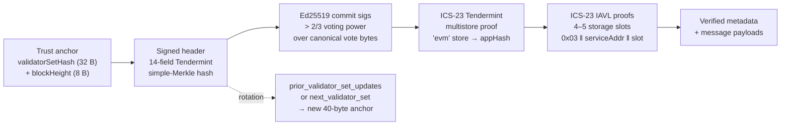
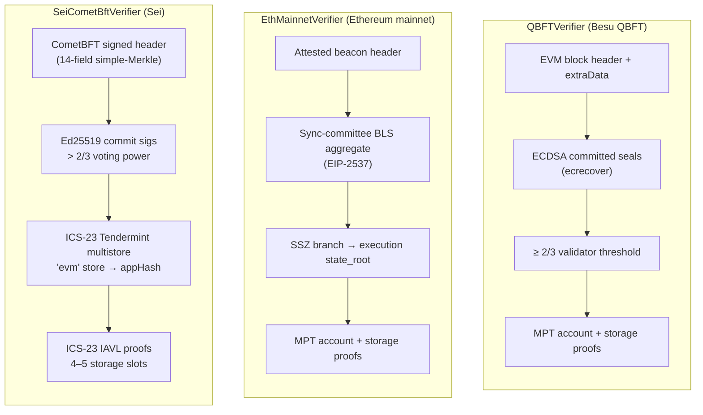
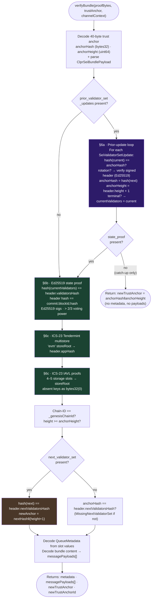
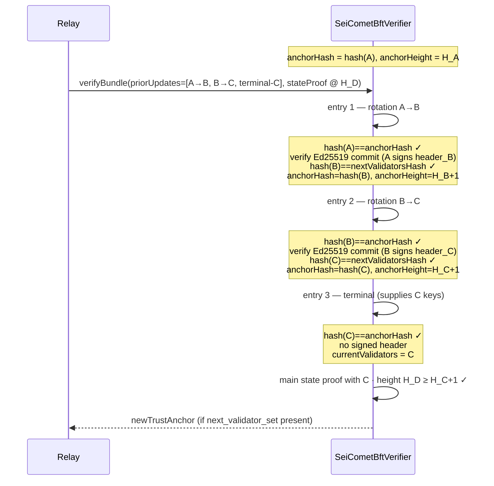
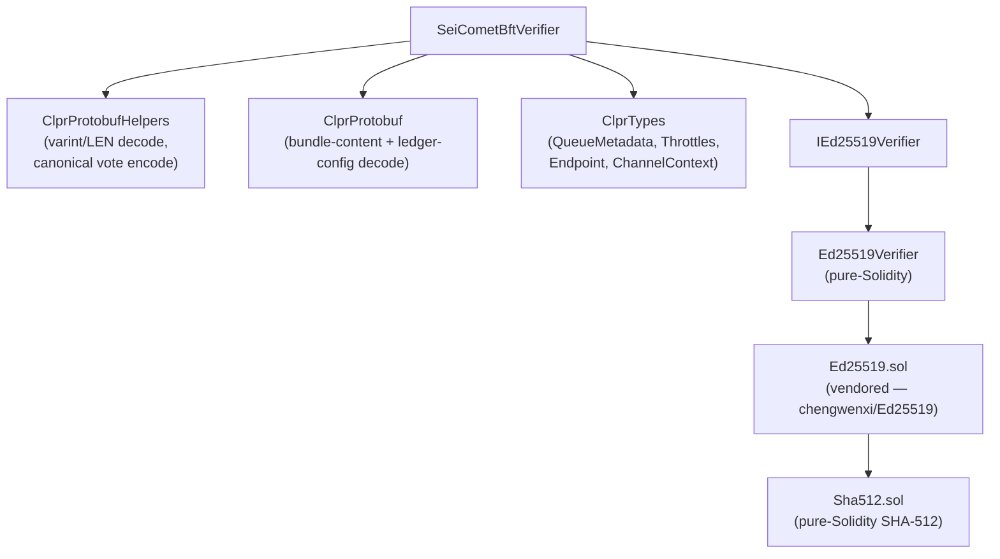

# SeiCometBftVerifier

> **Source**: [SeiCometBftVerifier.sol](./SeiCometBftVerifier.sol)
> **Interface**: [IClprVerifier.sol](../../interfaces/IClprVerifier.sol)

---

## 1. The big picture

The CLPR protocol needs to **trustlessly verify state from a peer Sei chain** entirely on-chain. `SeiCometBftVerifier` answers: *"prove to me that this bundle of cross-chain messages actually existed in the peer CLPR service contract's EVM storage on Sei."*

It is a real **CometBFT light client**: it builds a chain of cryptographic trust from a compact 40-byte trust anchor through Ed25519 multi-signature commits and two layers of ICS-23 Merkle proofs down to individual IAVL storage slots.



Each arrow is a proof verified on-chain. If any link breaks, the whole call reverts. The verifier holds **no mutable state** — trust is encoded entirely in the 40-byte anchor stored by `ClprService` per channel.

> [!IMPORTANT]
> **Ed25519 is injected, not assumed.** On Sei, address `0x09` maps to BLAKE2F, not the EIP-665 Ed25519 precompile. The verifier accepts an `IEd25519Verifier` dependency at construction time; production deployments use the pure-Solidity `Ed25519Verifier`. Chains that do support EIP-665 can pass a thin precompile wrapper instead.

---

## 2. Differences with QBFTVerifier and EthMainnetVerifier

Ethereum mainnet uses BLS sync-committee signatures; Besu uses ECDSA committed seals in `extraData`; Sei uses **Ed25519 multi-signatures** over CometBFT canonical vote bytes. The state commitment also differs: instead of an RLP block header `stateRoot` (QBFT) or SSZ `execution.state_root` (ETH), the verifier proves against CometBFT's `appHash` using **ICS-23 proofs** — a two-level Merkle system (Tendermint multistore spec at the top, IAVL spec per storage key below).



The **shared** part is the bottom: the storage slot layout (`cBase+1/+2/+4/+5`) and protobuf bundle-content decode are identical across all three verifiers. Only "how do we trust this state root?" differs.

---

## 3. Configuration & trust anchor

Unlike QBFT and ETH, the peer contract identity is not in the trust anchor — it is carried inside each bundle's ICS-23 IAVL keys (`0x03 ‖ serviceAddress ‖ slot`). The service address is established by `verifyConfig` and pinned via the per-channel `ChannelContext`.

The **trust anchor** is a flat **40-byte packed layout** (fixed offsets, no ABI overhead):

```
validatorSetHash32 ‖ blockHeight8
```

| Offset | Field | Bytes | Description |
|---|---|---|---|
| 0 | `validatorSetHash` | 32 | Tendermint simple-Merkle root over the active `SeiValidator[]`. Authenticates the validator keys re-supplied each bundle via `prior_validator_set_updates`. |
| 32 | `blockHeight` | 8 (big-endian uint64) | Block height at which this validator set became active. Guards against replaying bundles from old heights. |

The validator keys themselves are **not stored** — the anchor commits to them with the simple-Merkle hash. Per bundle the relay re-supplies the current validator set through `prior_validator_set_updates`, each entry authenticated against the anchor's `validatorSetHash`. This compresses the anchor from ~2 KB (ABI-encoded validator arrays) to 40 bytes, keeping per-channel `SLOAD` and `SSTORE` minimal.

`newTrustAnchorId` is the same 40 bytes as `newTrustAnchor` (not a period or an epoch number) — a compact, self-describing handle that encodes both which validator set and from which height it is valid.

---

## 4. Proof layout

### Bundle proof (protobuf `ClprSeiBundlePayload`)

| # | Field | Wire | Contents |
|---|---|---|---|
| 1 | `state_proof` | LEN | `SeiStateProof` — signed header, `"evm"` store key, multistore commitment proof, repeated storage-proof entries. Optional in catch-up-only bundles. |
| 2 | `bundle_content` | LEN | `ClprBundleContent` — message payloads. Optional in catch-up-only bundles. |
| 3 | `next_validator_set` | LEN (optional) | `SeiValidatorSet` — next validator keys, present only on rotation via the main state proof. |
| 4 | `prior_validator_set_updates` | LEN repeated | `SeiValidatorSetUpdate[]` — catch-up rotation chain; each entry carries `current_validators` (field 1), optional `signed_header` (field 2), optional `next_validators` (field 3). |

The rotation pair (3 & the rotation-type entry in 4) is **both-present or both-absent** per rotation event.

### Config proof (protobuf `ClprSeiLedgerConfigurationPayload`)

| # | Field | Wire | Contents |
|---|---|---|---|
| 1 | `initial_validator_set` | LEN | `SeiValidatorSet` proto |
| 2 | `initial_validator_set_height` | VARINT | int64 block height at which this set is active |
| 3 | `ledger_configuration` | LEN | `LedgerConfiguration` — chainId, serviceAddress, nanos, throttles, endpoints |
| 4 | `state_proof` | LEN | `SeiStateProof` — exactly one storage slot proving the service address |

### State proof (`SeiStateProof`)

| Field | Contents |
|---|---|
| 1 (LEN) | `SeiSignedHeader` — header (14 cdc-encoded fields) + commit (sig set + signersBits) |
| 2 (LEN) | Store key (`"evm"`) |
| 3 (LEN) | Multistore `CommitmentProof` (ICS-23 Tendermint spec) rooted at `header.appHash` |
| 4 (LEN repeated) | `SeiStorageProofEntry` → `{key, value, iavl_proof}` (existence or non-existence) |

---

## 5. Step-by-step verification flow

This is the core of [`verifyBundle`](./SeiCometBftVerifier.sol):



`newTrustAnchorId` is the same 40 bytes as `newTrustAnchor` — hash‖height — and is empty when no rotation occurred.

---

## 6. Deep dive: key steps

### §6a — Prior validator-set update chain

CometBFT validator sets rotate at arbitrary block heights. If the relay has fallen multiple epochs behind the on-chain trust anchor, it cannot include an arbitrarily long rotation chain *and* a state proof in one bundle. The `prior_validator_set_updates` field (proto field 4, repeated) solves this by letting the relay advance the verifier's working anchor through as many rotations as needed before the main state proof:



Every bundle that carries a state proof must include at least one `prior_validator_set_updates` entry — the **terminal entry** (field 3 absent) — to re-supply the current validator keys, since the trust anchor stores only their hash. A bundle with prior updates but **no state proof** is a catch-up-only bundle: the verifier walks all rotations, updates the working anchor, and returns immediately without metadata or payloads.

### §6b — Ed25519 commit verification

For each selected validator (bit set in `signersBits`), the verifier:

1. Constructs CometBFT **canonical vote bytes** (protobuf `CanonicalVote`):
   - `type = PRECOMMIT (2)`, `height`, `round`, `block_id.hash = computedHeaderHash`, `timestamp`, `chain_id`
   - `block_id.hash` is the **computed** header hash — not the one in the commit proto — binding the signature to the proven header.
2. Calls `IEd25519Verifier.verify(pubKey32, canonicalVoteBytes, signature64)`.
3. Accumulates `signedPower`. After all validators: requires `signedPower × 3 > totalPower × 2` (strict supermajority, 2/3+).

`signersBits` is a compact bit-vector, `ceil(n/8)` bytes. Padding bits beyond the validator count must be zero; the signature array must match the selected count exactly.

The header hash itself is the Tendermint **simple-Merkle root** over 14 cdc-encoded fields (`chainId`, `height`, `time`, `lastBlockId`, `lastCommitHash`, `dataHash`, `validatorsHash`, `nextValidatorsHash`, `consensusHash`, `appHash`, `lastResultsHash`, `evidenceHash`, `proposerAddress`), reproduced entirely on-chain.

### §6c — ICS-23 proof verification

**Tendermint multistore spec** (top level — proves store root from `appHash`):
- Leaf: `sha256(0x00 ‖ varLen(key) ‖ key ‖ varLen(value) ‖ value)`
- Inner ops: `hashOp = SHA256`, prefix 1 byte, child 32 bytes
- Store key must equal `"evm"`; any other key reverts with `InvalidStoreKey`

**IAVL spec** (bottom level — proves or disproves each storage slot):
- Same leaf spec. Branch direction is inferred from the suffix length:

| Condition | Branch direction |
|---|---|
| `suffix.length == 33` | Left branch — right child carried in suffix |
| `suffix.length == 0` | Right branch — left child embedded in prefix after 4–12 bytes |

**Non-existence proofs** require ≥ 1 neighbour whose existence proof verifies to the same `storeRoot`, with key ordering confirming the gap. Non-existent keys are returned as `bytes32(0)`. Zero-valued `Channel` slots are deleted from Sei's IAVL tree by the `x/evm` module, so both proof types are routine in practice.

### §6c — Storage slots

Shared with the EVM verifiers. IAVL keys are `0x03 ‖ serviceAddress(20B) ‖ slot(32B)` where `slot` is derived from the `_channels` mapping (base slot 17):

```
cBase = keccak256(abi.encode(channelId, 17))
```

| # | Slot | Field | Decoded |
|---|---|---|---|
| 0 | `cBase + 1` | `verifier(20) ‖ status(1) ‖ nextMessageId(8)` | `state`, `nextMessageId` |
| 1 | `cBase + 2` | `acked(8) ‖ received(8) ‖ nextExpectedReply(8)` | `receivedMessageId` |
| 2 | `cBase + 4` | `sentRunningHash` | `sentRunningHash` |
| 3 | `cBase + 5` | `receivedRunningHash` | `receivedRunningHash` |
| 4 (optional) | `msgBase + 1` | `runningHashAfterProcessing` | verified; not surfaced |

A bundle proves 4 entries (ACK-only) or 5 (message-bearing).

---

## 7. Library dependency map



| Library | Purpose | Shared with QBFT/ETH? |
|---|---|---|
| [ClprProtobufHelpers](../../libraries/codec/ClprProtobufHelpers.sol) | Varint / length-delimited decode, field encoding for canonical vote construction | Shared |
| [ClprProtobuf](../../libraries/codec/ClprProtobuf.sol) | Bundle-content decode, ledger-config decode | Shared |
| [ClprTypes](../../libraries/ClprTypes.sol) | Shared structs: `QueueMetadata`, `Throttles`, `Endpoint`, `ChannelContext` | Shared |
| [IEd25519Verifier](./lib/IEd25519Verifier.sol) | Injected signature verifier interface | Sei-only |
| [Ed25519Verifier](./Ed25519Verifier.sol) | Pure-Solidity Ed25519, for Sei (0x09 = BLAKE2F) | Sei-only |
| [Ed25519.sol](./lib/Ed25519.sol) | Vendored Ed25519 (chengwenxi, Apache-2.0, ported 0.6→0.8) | Sei-only |
| [Sha512.sol](./lib/Sha512.sol) | Pure-Solidity SHA-512 (used by Ed25519.sol) | Sei-only |

---

## 8. SeiCometBftVerifier vs QBFTVerifier vs EthMainnetVerifier

| Aspect | QBFTVerifier | EthMainnetVerifier | SeiCometBftVerifier |
|---|---|---|---|
| Proof items | 4 | 10 | **4 proto fields** (bundle) / **4 proto fields** (config) |
| Block authentication | QBFT committed seals in `extraData` | Sync-committee BLS aggregate (EIP-2537) | Ed25519 multi-sig over canonical vote bytes |
| Signature scheme | ECDSA secp256k1 (`ecrecover`) | BLS12-381 aggregate | Ed25519 (injected `IEd25519Verifier`) |
| State commitment | `stateRoot` in RLP EVM block header | `execution.state_root` via SSZ branch | `appHash` in CometBFT signed header |
| State proof | MPT (Merkle-Patricia) | MPT via SSZ branch | ICS-23 IAVL (two levels: multistore + slot) |
| Trust anchor | validator address set | flat 228 B: gvr‖forkVersion‖channelId‖aggregate‖committeeMerkleRoot | **40 B**: `validatorSetHash‖blockHeight` |
| Peer contract identity | from proof | constructor immutables | `ChannelContext` (set at `verifyConfig`) |
| Catch-up rotation | — | — | `prior_validator_set_updates` chain + catch-up-only bundles |
| Hash functions | keccak256 (MPT) | sha256 (SSZ) + keccak256 (MPT) | sha256 (ICS-23 + Ed25519) |
| Storage slots | caller-derived from `channelId` | caller-derived from `channelId` | caller-derived from `channelId` |
